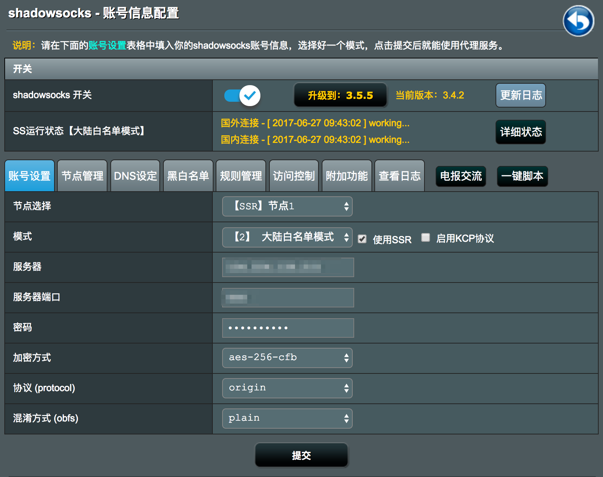

# R6250_Merlin

Netgear R6250 Router Flash Merlin Firmware.   
I buy a [R6250 Router](https://item.taobao.com/item.htm?spm=a1z10.1-c.w5003-16351714166.1.TBYsJK&id=522813720180&scene=taobao_shop) with the Merlin Firmware. But when I link it by 192.168.1.1 with default username: admin, password: password, the webpage show it's the official firmware, not Merlin. Thanks to the Customer Services's direct, I record the process here.  

Official Firmware: 高级->管理->路由器升级->浏览->选择 tomato-R6250-initial.chk ->上传, 升级.  
Tomato Firmware: Administration->Upgrade->Select 20161218-R6250_7.1.trx->Upgrade.  
Merlin Firmware: Skip Guide->username: admin, password: admin->系统管理->固件升级->选择文件 R6300V2_380.65-X7.4.trx->上传, 升级.  

---
系统管理->系统设置->Enable JFFS custom scripts and configs->是->应用本页面设置.
Software Center->未安装->shadowsocks->Config like this:  

